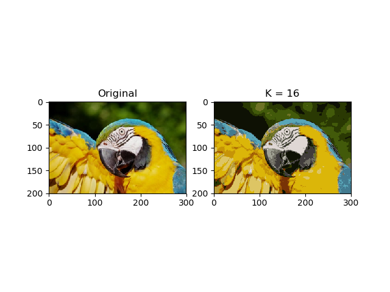

## Overview

RGB values are usually used to represent color of pixels. Typically, 3 bytes are required for each pixel, giving 2^24 different colors. However, in practice, images are often consisted of sets of pixels of similar colors.

Thy hypothesis here is that if a smaller and carefully chosen color set is used for the same image, the size of it can be reduced without compromising too much of its quality.

## Method

The algorithm used here for finding this color set is called k-means algorithm (or Lloyd's algorithm).

## Result

The following image shows the results of running my image compression algorithm on a 300*200 image, with 16 average colors and 10 iterations
{: .mx-auto.d-block :}

Assuming that no other compressions are applied, the original image needs 3 byte for each pixels. Whereas, the compressed one needs only 4 bits.

## Complexity

This method had a complexity of **O(nki)**, where:

- n is the number of pixels
- k is the number of average color
- i is the number of iteration

## Reference

- [k-means algorithm wikipedia](https://en.wikipedia.org/wiki/K-means_clustering#Standard_algorithm_(naive_k-means))
