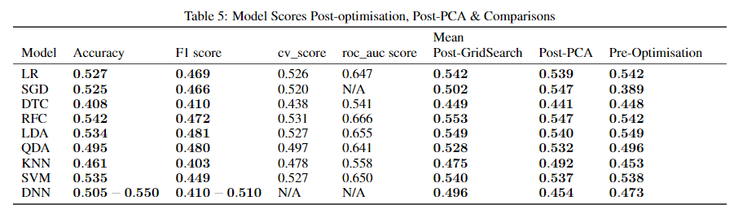

Access the full report [here]({{ site.url }}/assets/pdf/ML_Group.pdf).

### Overview

In this group project, me and my teammates used different models (KNN, Random Forest Classifier, DNN, SVM, etc.) to predict the outcomes given the historical performance of the competing teams. Apart from the historical performance, we crafted features such as ELO rating which is often used in Chess games and recent strength by referring to literature. We also used NLP on players' twitters to analyze their psychology.

### Results

{: .mx-auto.d-block :}

We evaluate F1-score and cross-validation score of each model and conclude that DNN, Linear Discriminant Analysis and Random Forest Classifier are the most effective models among all for this problem.